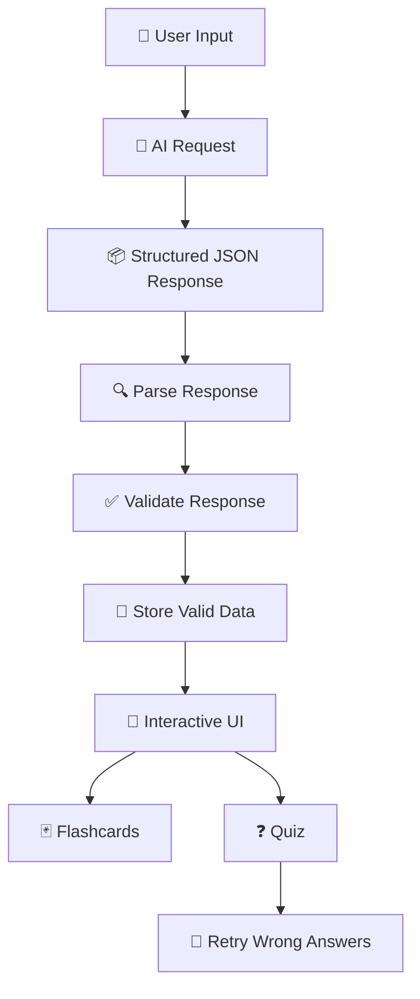
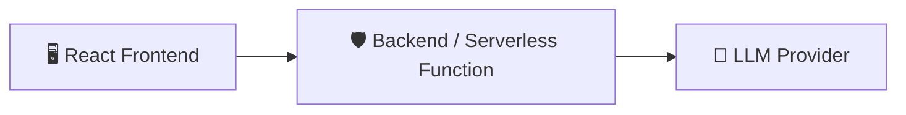

<div align="center">

<h1>Study Assistant</h1>

<br/>

<p>
  
</p>

<br/>


<br/>

<a href="https://study-assistant-gold.vercel.app"></a>
<a href="https://youtu.be/JdGPubKn76E"></a>
<a href="https://github.com/SahilAgroha/StudyAssistant"></a>

</div>

<br/>


---

<div align="center">

## 📚 Table of Contents

</div>

<table align="center" border="0">
<tr>
<td valign="top" width="33%">

**🎯 Getting to Know It**
- [Overview](#-overview)
- [Features](#-features)
- [Tech Stack](#️-tech-stack)

</td>
<td valign="top" width="33%">

**⚙️ Under the Hood**
- [How It Works](#️-how-it-works)
- [AI Integration](#-ai-integration)
- [Error Handling](#-error-handling)

</td>
<td valign="top" width="33%">

**🕹️ Using the App**
- [Flashcards](#-flashcards)
- [Quiz](#-quiz)
- [Getting Started](#-getting-started)

</td>
</tr>
<tr>
<td valign="top" width="33%">

**🏗️ Structure & Safety**
- [Project Structure](#-project-structure)
- [Security](#-security)
- [Responsive Design](#-responsive-design)

</td>
<td valign="top" width="33%">

**📌 The Fine Print**
- [AI Usage Disclosure](#-ai-usage-disclosure)
- [Known Limitations](#️-known-limitations)
- [Future Improvements](#-future-improvements)

</td>
<td valign="top" width="33%">

**🏁 Wrap-up**
- [Requirements Checklist](#-assignment-requirements)
- [Live Demo & Recording](#-live-demo--recording)
- [Author](#-author)

</td>
</tr>
</table>

---

<div align="center">

## 🎯 Overview

</div>

> **Study Assistant** is a React + TypeScript application that converts free-form study notes or topics into **interactive flashcards and quizzes** using a real LLM API.

Instead of dumping raw chatbot output onto the screen, the app **parses and validates** the AI's structured JSON response before rendering it as fully interactive learning components — protecting the UI from malformed, incomplete, or unexpected AI output.

<div align="center">
<table>
<tr>
<th>🧠 Input</th>
<th>⚙️ Processing</th>
<th>🎨 Output</th>
</tr>
<tr>
<td align="center">Free-form notes or a topic</td>
<td align="center">LLM call → parse → validate</td>
<td align="center">Interactive flashcards & quiz</td>
</tr>
</table>
</div>

---

<div align="center">

## ✨ Features

</div>

<table>
<tr>
<td width="50%" valign="top">

### 🎓 Learning Experience
- 📝 Free-form input for study notes or topics
- 🃏 AI-generated flashcards
- 🔄 Interactive flashcard navigation & flipping
- ❓ AI-generated multiple-choice quizzes
- 🎯 Quiz score calculation
- ✅❌ Correct / incorrect answer handling
- 🔁 Retry incorrectly answered questions

</td>
<td width="50%" valign="top">

### 🛡️ Reliability & Resilience
- 🛡️ Structured AI response parsing & validation
- ⚠️ Malformed JSON handling
- 🚫 Invalid response-shape handling
- 📭 Empty response handling
- 🔌 API failure handling
- ⏳ Loading, error, and empty states
- 🕰️ Protection against stale AI responses
- 📱 Fully responsive — mobile to desktop

</td>
</tr>
</table>

---

<div align="center">

## 🛠️ Tech Stack

<table>
<tr>
<td align="center" width="140"><br/><b>React</b></td>
<td align="center" width="140"><br/><b>TypeScript</b></td>
<td align="center" width="140"><br/><b>Vite</b></td>
<td align="center" width="140"><br/><b>Tailwind</b></td>
</tr>
</table>

| Layer | Technology |
|:--|:--|
| ⚛️ UI Layer | React + React Hooks |
| 🧩 Language | TypeScript |
| ⚡ Build Tool | Vite |
| 🎨 Styling | Tailwind CSS |
| 🤖 Intelligence | AI / LLM API |
| 🌐 Communication | REST API |

</div>

---

<div align="center">

## ⚙️ How It Works

</div>

The application follows a structured AI data flow:



> 🔒 **Trust Boundary:** The AI response is treated as **untrusted input**. It is parsed and validated before ever touching a React component — preventing malformed or unexpected AI output from crashing the application.

---

<div align="center">

## 🤖 AI Integration

</div>

The app prompts an LLM to generate structured study material from the user's input. The expected response contains **flashcards** and **quiz questions** — not conversational text.

<details>
<summary><b>📦 Click to view example response structure</b></summary>

```json
{
  "questions": [
    {
      "question": "What is a process in an operating system?",
      "options": [
        "A program in execution",
        "A type of hardware",
        "A database",
        "A network protocol"
      ],
      "correctAnswer": 0
    }
  ],
  "flashcards": [
    {
      "question": "What is a process?",
      "answer": "A process is a program that is currently being executed."
    }
  ]
}
```

</details>

The application validates this structure before rendering **any** generated content.

---

<div align="center">

## 🚨 Error Handling

</div>

AI-generated responses are unpredictable, so the app handles multiple failure scenarios gracefully — **nothing reaches the UI unvalidated.**

<table>
<tr><th>⚠️ Scenario</th><th>🛡️ Behavior</th></tr>
<tr><td><b>Malformed JSON</b></td><td>Response is rejected; user sees an error with a retry option</td></tr>
<tr><td><b>Invalid Response Shape</b></td><td>Valid JSON but wrong structure is rejected before reaching the UI</td></tr>
<tr><td><b>Empty Response</b></td><td>Displays an appropriate empty/error state</td></tr>
<tr><td><b>API Failure</b></td><td>Network errors and unavailable services handled without crashing</td></tr>
<tr><td><b>Stale Responses</b></td><td>An older, slower request can never overwrite a newer result</td></tr>
</table>

<details>
<summary><b>🕰️ Click to see the stale-response protection diagram</b></summary>

```
Request A ────────────────────────→ finishes later
Request B ───────→ finishes first
                       ↓
                 Display B
```

If Request A finishes *after* Request B, its result is silently ignored.

</details>

---

<div align="center">

## 🃏 Flashcards

</div>

<table>
<tr>
<td width="55%" valign="top">

The flashcard section allows users to:

- 👀 View generated questions
- 🔄 Flip cards to reveal answers
- ➡️ Navigate between cards
- 📍 Track their current position

</td>
<td width="45%" valign="top">

```
     Card 2 of 10

┌───────────────────────┐
│                       │
│  What is a thread?    │
│                       │
└───────────────────────┘

   ◀ Previous   Next ▶
```

</td>
</tr>
</table>

---

<div align="center">

## ❓ Quiz

</div>

The quiz section provides an interactive multiple-choice experience. Users can:

| Action | Description |
|:--|:--|
| 🖱️ Select | Choose an answer for each question |
| ➡️ Navigate | Move through questions freely |
| 📤 Submit | Submit the completed quiz |
| 🎯 Score | View final score instantly |
| 🔍 Review | Review incorrect answers |
| 🔁 Retry | Retry **only** the questions answered incorrectly |

> ♻️ Retry reuses the existing incorrect questions locally — **no additional AI call is made.**

---

<div align="center">

## 📁 Project Structure

</div>

```
src/
├── components/        # UI building blocks (flashcards, quiz, states)
│   ├── ...
│   └── ...
├── services/          # AI / API integration logic
│   └── ...
├── types/             # Shared TypeScript types
│   └── ...
├── utils/             # Parsing & validation helpers
│   └── ...
├── App.tsx
├── main.tsx
└── ...
```

> 🧱 The project separates UI components, AI/service logic, types, and validation logic to keep the application maintainable and testable.

---

<div align="center">

## 🚀 Getting Started

</div>

### ✅ Prerequisites


<table>
<tr><td width="30"><b>1️⃣</b></td><td>

**Clone the repository**
```bash
git clone https://github.com/SahilAgroha/StudyAssistant
```

</td></tr>
<tr><td><b>2️⃣</b></td><td>

**Navigate to the project**
```bash
cd StudyAssistant
```

</td></tr>
<tr><td><b>3️⃣</b></td><td>

**Install dependencies**
```bash
npm install
```

</td></tr>
</table>

### 🔑 Environment Variables

Create a `.env` file and add the required AI configuration:

```env
AI_API_KEY=your_api_key_here
```

> ⚠️ **Never commit API keys or other secrets to the repository.**

### ▶️ Run Locally

```bash
npm run dev
```

The application will be available at the local URL displayed by Vite.

### 📦 Build for Production

```bash
npm run build
```

---

<div align="center">

## 🔒 Security

</div>

The AI API key must **never** be exposed in browser-side code.



This keeps the API credential safely on the server side, out of reach of the client.

---

<div align="center">

## 📱 Responsive Design

</div>

<table align="center">
<tr>
<td align="center">🖥️<br/><b>Desktop</b></td>
<td align="center">📟<br/><b>Tablet</b></td>
<td align="center">📱<br/><b>Mobile</b></td>
</tr>
<tr>
<td align="center">Full layout</td>
<td align="center">Adaptive grid</td>
<td align="center">Stacked, touch-friendly</td>
</tr>
</table>

Main interactive elements — flashcards, quiz options, navigation controls, and action buttons — all adapt fluidly to smaller screens.

---

<div align="center">

## 🤝 AI Usage Disclosure

</div>

AI development tools were used during the development of this assignment for:

<table>
<tr>
<td>🐛 Debugging React & TypeScript issues</td>
<td>🔎 Reviewing implementation approaches</td>
</tr>
<tr>
<td>🧭 Identifying edge cases</td>
<td>🛡️ Improving error handling</td>
</tr>
<tr>
<td>🏗️ Reviewing code structure</td>
<td>🎨 Suggesting UI improvements</td>
</tr>
</table>

> ✅ All AI-generated suggestions were reviewed and adapted during development. The final implementation is understood and can be explained and modified independently.

---

<div align="center">

## ⚠️ Known Limitations

</div>

- 🎓 AI-generated educational content may occasionally contain factual inaccuracies
- 🧩 Response validation verifies structure but cannot guarantee factual correctness
- 🌐 AI generation depends on API availability and network connectivity
- ⏱️ Generation time may vary depending on the selected AI provider
- ☁️ Persistent user accounts and cloud-based study-session storage are not currently implemented

---

<div align="center">

## 🔮 Future Improvements

</div>

- [ ] 💾 Save and reload study sessions
- [ ] 📈 Learning progress tracking
- [ ] 🎚️ Difficulty selection
- [ ] 🗂️ Subject/category organization
- [ ] ✨ AI-powered refinement of existing questions
- [ ] 🌊 Streaming AI responses
- [ ] ⌨️ Keyboard navigation
- [ ] 🌙 Dark mode
- [ ] 📊 Detailed learning analytics

> These features were intentionally kept outside the core implementation to maintain a focused and reliable application.

---

<div align="center">

## ✅ Assignment Requirements

*Developed according to the Frontend Internship Assignment requirements.*

<table>
<tr><td>React with hooks</td><td>✅</td><td>Free-form text input</td><td>✅</td></tr>
<tr><td>Real LLM API</td><td>✅</td><td>Structured AI output</td><td>✅</td></tr>
<tr><td>Interactive stateful UI</td><td>✅</td><td>Flashcards</td><td>✅</td></tr>
<tr><td>Quiz</td><td>✅</td><td>Retry wrong answers</td><td>✅</td></tr>
<tr><td>Malformed JSON handling</td><td>✅</td><td>Invalid response handling</td><td>✅</td></tr>
<tr><td>Empty response handling</td><td>✅</td><td>API failure handling</td><td>✅</td></tr>
<tr><td>Loading state</td><td>✅</td><td>Error state</td><td>✅</td></tr>
<tr><td>Empty state</td><td>✅</td><td>Stale response protection</td><td>✅</td></tr>
<tr><td>Mobile support</td><td>✅</td><td>README</td><td>✅</td></tr>
</table>

**18 / 18 requirements complete** 🎉


</div>

---

<div align="center">

## 🌐 Live Demo & Recording

<a href="https://study-assistant-gold.vercel.app"></a>
<br/><br/>
<a href="https://youtu.be/JdGPubKn76E"></a>
<br/><br/>
<a href="https://github.com/SahilAgroha/StudyAssistant"></a>

<br/><br/>

⏱️ **Time Spent:** Approximately `7hr+` was spent developing this assignment.

</div>

---

<div align="center">

## 👤 Author


### **Sahil**
🎓 B.Tech Information Technology · IIIT Bhopal

<a href="https://github.com/SahilAgroha/"></a>
<a href="https://www.linkedin.com/in/sahilagroha/"></a>

</div>

<br/>


<div align="center">

*Made with ⚛️ React, 🧠 AI, and a lot of ☕*

</div>
